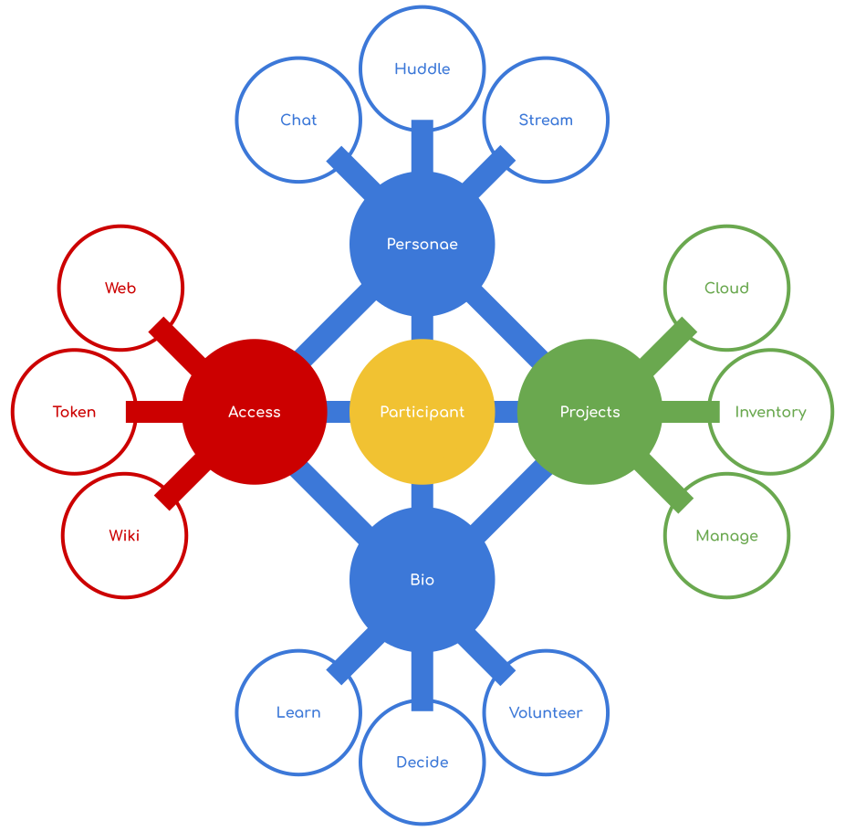

# TMI: A participant centric toolset

## What's in the box?

Each tool, a complete open source project on its own, is arranged in four
categories around each participant:

### Access

The tribe is made accessible through the Web, Wiki and Tokens.
Tokens may include logins, subscriptions, sponsorships or gifts.

### Personae

Each participant radically expresses themselves through social, audio, video and streams
personae.

### Bio

A participant builds social capital by investing in the community through
participation. Their bio is a testament to that in their learning, teaching,
decision making and volunteering within the community.

### Projects

A participant captures ideas in the Cloud; these ideas turn into projects to be
managed. Within the same system assets related to the projects are able to be
inventoried and maintenance schedules introduced.

## How'd we get here? In order of increasing geekyness, you may want to learn more about the:

* [Context](./docs/context.md),
* [requirements](./docs/requirements.md) and
* [blue sky information architecture](./docs/information-architecture.md)

