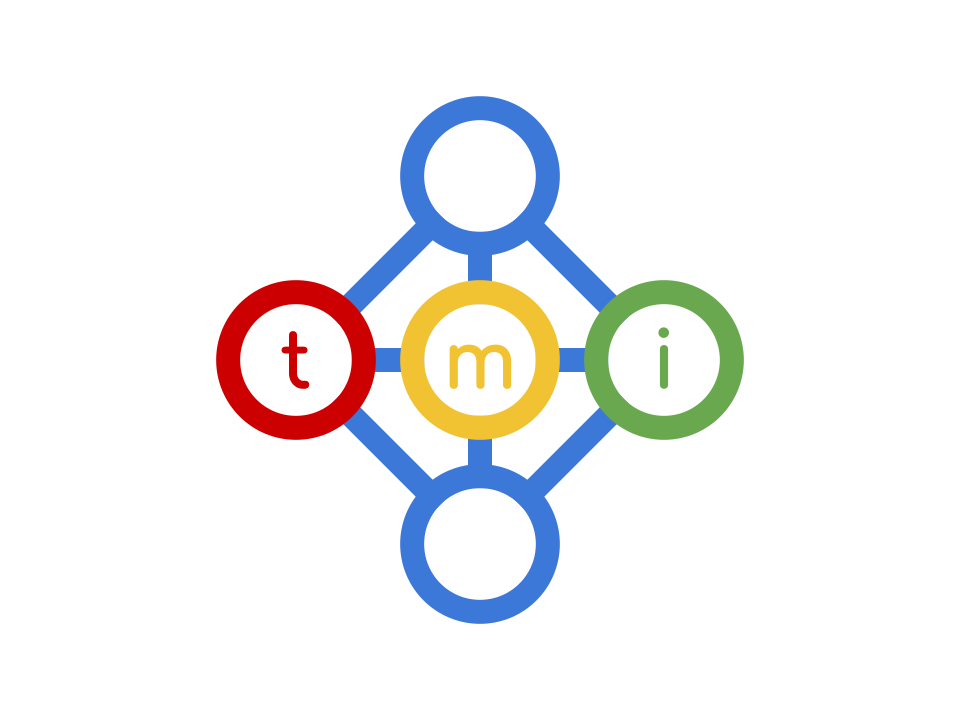

# Tribe Mobilisation Infrastructure

Tools to empower and mobilise communities so that they may co-create. 

* **Find**, **create** and **share** resources.
* **Cultivate**, **coordinate** and **collaborate** on projects.

In an ecosystem that nurtures, protects and promotes its participants.

Learn more about the [context](./docs/context.md), [requirements](./docs/requirements.md) and [abstract information architecture](./docs/architecture.md) of the system.

TMI is a collection of [open source]() software to be loosely integrated into a [microservice](https://microservices.io)(ish) architecture to answer these requirements.

| Component | Tech | Description | Status |
| -- | -- | -- | -- |
| Bio | [Drupal](https://drupal.org) | User authentication. | Rescue select functionality from the [existing tribe system](https://github.com/afrikaburn/tribe).
| Chat | [RocketChat](https://rocket.chat) & [Jitsi](https://jitsy.org) | Social, Text, Voice and Video. | Live. Social to be developed. |
| Cloud | [NextCloud](https://nextcloud.) | Cloud drive, collaborative office suite, information gathering and sharing. | Checking it out. |
| Collaborate | [Loomio](https://loomio.org) | Collaboration, Voting, Group decision making. | Checking it out. |
| Learn | [Moodle](https://moodle.org) | Learning management. | Checking it out. |
| Volunteer| [Playasoft volunteers](https://github.com/playasoft/volunteers) | Volunteer, Event and Shift management. | Checking it out. |
| Web | [Drupal](drupal.org) | Public Web Presence | Being populated. |
