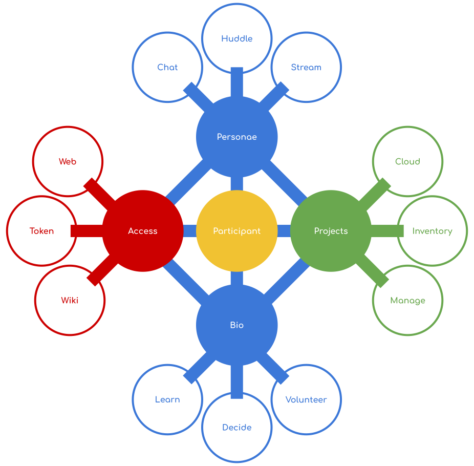

# Tribe Mobilisation Infrastructure

An ecosystem of online tools to nurture, protect and empower participants to:

* **Create**, **Find** and **Share** resources
* **Catalyse**, **Collaborate** on and **Achieve** projects
* **Collect**, **Expand** and **Promote** knowledge
* **Cultivate**, **Educate** and **Inspire** people
* **Dream**, **Determine** and **Realise** a future

## Participant Centric Toolset

Each tool, a complete open source project on its own, is arranged in four
categories around each participant:

### How'd we get here?

In order of increasing geekyness, you may want to learn more about the:
* [context](./docs/context.md),
* [requirements](./docs/requirements.md) and
* [blue sky information architecture](./docs/information-architecture.md)

### Access

The tribe is made accessible through the Web, Wiki and Tokens.
Tokens may include logins, subscriptions, sponsorships or gifts.

| Tool | Use | System | Fork | Status |
| -- | -- | -- | -- | -- |
| Web    | Introductory website             | [Drupal](https://drupal.org)                          | [TMI-Web](https://github.com/AfrikaBurn/TMI-Web)                   | Being populated.
| Token  | Token granting and distribution  |
|        | System access control            | [OpenLDAP](openldap.org)                              | [TMI-Access-Token](https://github.com/AfrikaBurn/TMI-Access-Token) | Users to be migrated from [existing tribe system](https://github.com/afrikaburn/tribe).
|        |                                  | [Keycloak](https://www.keycloak.org/)                 |                                                                    | To be configured to connect to LDAP and expose OAuth etc.
|        | Event Ticketing                  | [Drupal](https://www.drupal.org/)                     | To be forked.                                                      | Quicket integration to be extracted from the [existing tribe system](https://github.com/afrikaburn/tribe).
| Wiki   | Knowledge archive                | [MediaWiki](https://www.mediawiki.org/wiki/MediaWiki) | [TMI-Know](https://github.com/AfrikaBurn/TMI-Know)                 | To be added to repo for evaluation.

### Personae

Each participant radically expresses themselves through chat, video and stream
personae.

| Tool | Use | System | Fork | Status |
| -- | -- | -- | -- | -- |
| Social    | Online social interaction
|           | Text chat                         | [RocketChat](https://rocket.chat)         | [TMI-Chat](https://github.com/AfrikaBurn/TMI-Chat)      | Live. Social aspects to be developed.
|           | Social network and sharing        | TBDs
| Huddle    | Video conferencing                | [Jitsi](https://jitsi.org)                | [TMI-Huddle](https://github.com/AfrikaBurn/TMI-Huddle)  | Live.
| Stream    | Text/Audio/Visual/Social streaming| [~~MediaGoblin~~](http://mediagoblin.org) | [TMI-Stream](https://github.com/AfrikaBurn/TMI-Stream)  | To be found.

### Bio

A participant builds social capital by investing in the community through
participation. Their bio is a testament to that in their learning, teaching,
decision making and volunteering within the community.

| Tool | Use | System | Fork | Status |
| -- | -- | -- | -- | -- |
| Learn     | Learning and acculturation
|           | Learning platform.                        | [Moodle](https://moodle.org) & [h5p](https://h5p.org)| [TMI-Learn-Moodle](https://github.com/AfrikaBurn/TMI-Learn-Moodle) & [TMI-Learn-h5p](https://github.com/AfrikaBurn/TMI-Learn-h5p) | Pending evaluation.
|           | Experience and interactive enhancement.   | [Moodle](https://moodle.org) & [h5p](https://h5p.org)| [TMI-Learn-Moodle](https://github.com/AfrikaBurn/TMI-Learn-Moodle) & [TMI-Learn-h5p](https://github.com/AfrikaBurn/TMI-Learn-h5p) | Pending evaluation.
| Decide    | Collaborative decision making.            | [Loomio](https://loomio.org)                         | [TMI-Decide](https://github.com/AfrikaBurn/TMI-Decide)                                                                            | Evaluating.
| Volunteer | Volunteer, Event and Shift management.    | [Volunteers](https://github.com/playasoft/volunteers)| [TMI-Volunteer](https://github.com/AfrikaBurn/TMI-Volunteer)                                                                      | Pending evaluation.

### Projects

A participant captures ideas in the Cloud; these ideas turn into projects to be
managed. Within the same system assets related to the projects are able to be
inventoried and maintenance schedules introduced.

| Tool | Use | System | Fork | Status |
| -- | -- | -- | -- | -- |
| Cloud     | Cloud office, data capturing/processing and information sharing/presentation suite.   | [NextCloud](https://nextcloud.org)    | [TMI-Cloud](https://github.com/AfrikaBurn/TMI-Cloud)          | Pending evaluation.
| Manage    | Project management.                                                                   | [OpenProject](http://openproject.org) | [TMI-Manage](https://github.com/AfrikaBurn/TMI-Manage)        | Being evaluated.
| Inventory | Asset maintenance and tracking.                                                       | [PartKeepr](https://partkeepr.org)    | [TMI-Inventory](https://github.com/AfrikaBurn/TMI-Inventory)  | Pending evaluation.
| Budget    | Financial planning and tracking.                                                      | TBD

## Where to now?

TMI is being implemented as a collection of loosely integrated, containerised
microservices operated using [Kubernetes](https://kubernetes.io) or
[Swarmpit](https://swarmpit.io), integrated using [Node.js](https://nodejs.org)
and [React](https://reactjs.org).
