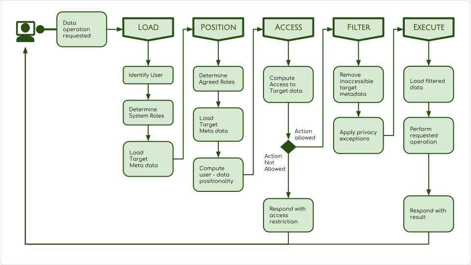
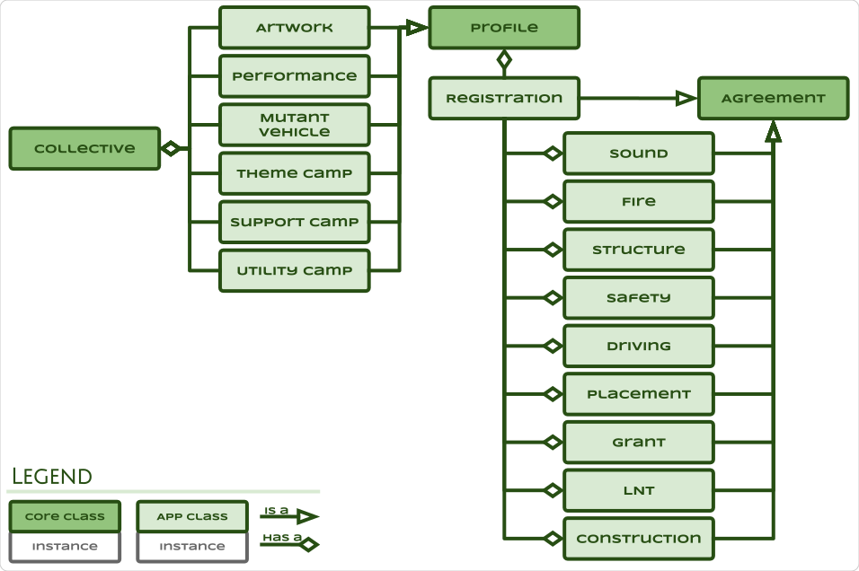

# TMI - Tribe Mobilisation Infrastructure

## Introduction

A set of tools to empower and mobilise communities to realise their own
projects; A space to find and share resources without commercial agenda; A means
to publish and share information without bias or manipulation; A facilitator of
agreements; An ecosystem that nurtures, protects and promotes its participants.

* [Read more](./docs/Introduction.pdf)

>This is the container project for the TMI ecosystem documentation and source
code. The various components may be checked out individually as per repository
links in sections below.

## Components

* [People](#people)
* [Administration](#administration)
* [Tribe](#tribe)
* [Projects](#projects)
* [Events](#events)
* [Incidents](#incidents)
* [Ground Zero](#ground-zero)
* [Inventory](#inventory)
* [Web](#web)

## People

Core backend service to manage, guard and interact with user data.

### Request Processing

All dynamic requests to the people service are processed in the following
manner:

### Entity Relationships

### Entity Classes

|||
--- | ---
|Repository|[Github](https://github.com/AfrikaBurn/TMI-People)|
|Language|[Javascript](https://www.javascript.com/)|
|Tech|[NodeJS](https://nodejs.org)|
||[JSON Schema](https://json-schema.org/)|
|Frameworks|[Express](https://expressjs.com/)|
||[MiniMi](https://github.com/scheepers/minimi)|
|API|[RESTful](https://github.com/AfrikaBurn/TMI-People/blob/master/API.md)|
|Progress|80ish%|

>TODO
- [ ] Access and permission checking of agreements.
- [ ] Access and permission checking of posts.
- [ ] Database stash.
- [ ] Postman test cases.
- [ ] Expand tests to inlude invalid requests.
- [ ] People API readme.

[Back to Index](#components)

## Administration

Administrative front-end to the people subsystem.

### Wireframes

|||
--- | ---
|Repository|[Github](https://github.com/AfrikaBurn/TMI-Admin)|
|Language|[Javascript](https://www.javascript.com/)|
|Tech|[Angular](https://angular.io)|
||[JSON Schema](https://json-schema.org/)|
|Frameworks|[Material design](https://material.angular.io/)|
|API|NONE|
|Progress|10ish%|

>TODO & TODOC
- [ ] Wireframes.
- [ ] Data model.
- [ ] Development.
- [ ] Readme.

[Back to Index](#components)

## Tribe

Social networking app to represent, connect and collect participants.

### Use Cases

### Entity Classes

### Wireframes

|||
--- | ---
|Repository|[github project]|
|Language|UP FOR GRABS|
|Tech|UP FOR GRABS|
|Frameworks|UP FOR GRABS|
|API|UP FOR GRABS|
|Progress|0%|

>TODO & TODOC
- [ ] Repository
- [ ] Wireframes.
- [ ] Repository.
- [ ] Development.
- [ ] Readme.
- [ ] User agreements
- [ ] User profiles

[Back to Index](#components)

## Projects

Create and collaborate.

### Use Cases

### Entity Classes

### Wireframes

|||
--- | ---
|Repository|[github project]|
|Language|UP FOR GRABS|
|Tech|UP FOR GRABS|
|Frameworks|UP FOR GRABS|
|API|UP FOR GRABS|
|Progress|0%|

>TODO & TODOC
- [ ] Repository
- [ ] Wireframes.
- [ ] Development.
- [ ] Readme.
- [ ] Collective profiles
- [ ] Collective agreements

[Back to Index](#components)

## Events

Event organisation app, that allows scheduling, coordination and participation.

### Use Cases

### Entity Classes

### Wireframes

|||
--- | ---
|Repository|[github project]|
|Design|[Wireframes](./docs/Event-Wireframes.svg)|
|Language|UP FOR GRABS|
|Tech|UP FOR GRABS|
|Frameworks|UP FOR GRABS|
|API|UP FOR GRABS|
|Progress|0%|

>TODO & TODOC
- [ ] Repository
- [ ] Wireframes.
- [ ] Data model.
- [ ] Development.
- [ ] Readme.
- [ ] Event collective profile.
- [ ] Event attendance agreement.
- [ ] Shift collective profile.
- [ ] Shift attendance agreement.

[Back to Index](#components)

## Incidents

Incident app that logs, disseminates and escalates.

### Use cases

### Entity Classes

### Wireframes

|||
--- | ---
|Repository|[github project]|
|Language|UP FOR GRABS|
|Tech|UP FOR GRABS|
|Frameworks|UP FOR GRABS|
|API|UP FOR GRABS|
|Progress|0%|

>TODO & TODOC
- [ ] Repository
- [ ] Wireframes.
- [ ] Data model.
- [ ] Development.
- [ ] Readme.
- [ ] Log collective profile.
- [ ] Log entry post type.

[Back to Index](#components)

## Ground Zero

Realtime monitoring app of interactive statistics and trends.

### Wireframes

|||
--- | ---
|Repository|[github project]|
|Design|[Wireframes](./docs/Ground-Zero-Wireframes.svg)|
|Language|UP FOR GRABS|
|Tech|UP FOR GRABS|
|Frameworks|UP FOR GRABS|
|API|UP FOR GRABS|
|Progress|0%|

>TODO & TODOC
- [ ] Repository
- [ ] Use cases.
- [ ] Wireframes.
- [ ] Data model.
- [ ] Repository.
- [ ] Development.
- [ ] Readme.

[Back to Index](#components)

## Inventory

Manage, track and trace assets and inventory.

### Use Cases

### Entity Classes

### Wireframes

|||
--- | ---
|Repository|[github project]|
|Language|UP FOR GRABS|
|Tech|UP FOR GRABS|
|Frameworks|UP FOR GRABS|
|API|UP FOR GRABS|
|Progress|0%|

>TODO & TODOC
- [ ] Repository
- [ ] Wireframes.
- [ ] Data model.
- [ ] Development.
- [ ] Readme.
- [ ] Inventory collective profile.
- [ ] Inventory item post type.
- [ ] Inventory item state post type.
- [ ] Inventory item list post type.

[Back to Index](#components)

## Web

Website that educates, informs and promotes projects, collectives, initiatives
and events.

### Use Cases

### Entity Classes

|||
--- | ---
|Repository|[github project]|
|Language|UP FOR GRABS|
|Tech|UP FOR GRABS|
|Frameworks|UP FOR GRABS|
|API|UP FOR GRABS|
|Progress|0%|

>TODO & TODOC
- [ ] Repository
- [ ] Wireframes.
- [ ] Data model.
- [ ] Development.
- [ ] Readme.

[Back to Index](#components)

