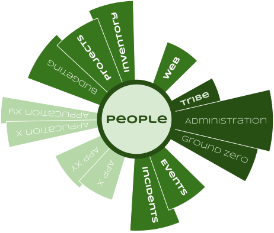
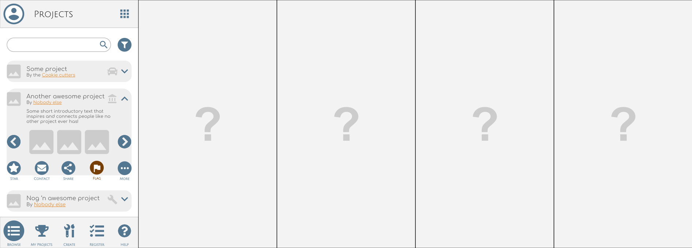

# TMI - Tribe Mobilisation Infrastructure

>This is a container project for the TMI ecosystem documentation and source code
as a whole. The various subprojects may be checked out individually as per the
project links in the sections below.

## Introduction

A set of tools to empower and mobilise communities to realise their own
projects; A tool to find and share resources without commercial agenda; A means
to publish and share information without bias or manipulation; A facilitator of
agreements; An ecosystem that nurtures, protects and promotes its participants.

* [Read more](./docs/Introduction.pdf)

### People

Core backend service to manage, guard and access user data.

[People Entity Relationships](./docs/People-Entity-Relationships.svg) |
[People Entity Classes](./docs/People-Class-Diagram.svg) |
[People github project](https://github.com/AfrikaBurn/TMI-People)

|||
--- | ---
|Language|[Javascript](https://www.javascript.com/)|
|Tech|[NodeJS](https://nodejs.org)|
||[JSON Schema](https://json-schema.org/)|
|Frameworks|[Express](https://expressjs.com/)|
||[MiniMi](https://github.com/scheepers/minimi)|
|API|RESTful ([Check it out here](https://github.com/AfrikaBurn/TMI-People/blob/master/API.md))|
|Progress|80ish%|

>TODO
- [ ] Access and permission checking of agreements.
- [ ] Access and permission checking of posts.
- [ ] Database stash.
- [ ] Postman test cases.
- [ ] Expand tests to inlude invalid requests.
- [ ] People API readme.

### Administration

Administrative front-end to the people subsystem.

|||
--- | ---
|Language|[Javascript](https://www.javascript.com/)|
|Tech|[Angular](https://angular.io)|
||[JSON Schema](https://json-schema.org/)|
|Frameworks|[Material design](https://material.angular.io/)|
|API|NONE|
|Progress|10ish%|

[TMI Administration github project](https://github.com/AfrikaBurn/TMI-Admin).

>TODO & TODOC
- [ ] Wireframes.
- [ ] Data model.
- [ ] Development.
- [ ] Readme.

### Tribe

Social networking app to represent, connect and collect participants.

|||
--- | ---
|Language|UP FOR GRABS|
|Tech|UP FOR GRABS|
|Frameworks|UP FOR GRABS|
|API|NONE / UP FOR GRABS|
|Progress|0%|

>TODO & TODOC
- [ ] Repository
- [ ] Wireframes.
- [ ] Data model.
- [ ] Repository.
- [ ] Development.
- [ ] Readme.
- [ ] User agreements
- [ ] User profiles

### Projects

Create and collaborate.

|||
--- | ---
|Language|UP FOR GRABS|
|Tech|UP FOR GRABS|
|Frameworks|UP FOR GRABS|
|API|RESTFull - UP FOR GRABS|
|Progress|0%|

>TODO & TODOC
- [ ] Repository
- [ ] Wireframes.
- [ ] Data model.
- [ ] Development.
- [ ] Readme.
- [ ] Collective profiles
- [ ] Collective agreements

### Events

Event organisation app, that allows scheduling, coordination and participation.

|||
--- | ---
|Language|UP FOR GRABS|
|Tech|UP FOR GRABS|
|Frameworks|UP FOR GRABS|
|API|UP FOR GRABS|
|Progress|0%|

>TODO & TODOC
- [ ] Repository
- [ ] Wireframes.
- [ ] Data model.
- [ ] Development.
- [ ] Readme.
- [ ] Event collective profile.
- [ ] Event attendance agreement.
- [ ] Shift collective profile.
- [ ] Shift attendance agreement.

### Incidents

Incident app that logs, disseminates and escalates.

|||
--- | ---
|Language|UP FOR GRABS|
|Tech|UP FOR GRABS|
|Frameworks|UP FOR GRABS|
|API|UP FOR GRABS|
|Progress|0%|

>TODO & TODOC
- [ ] Repository
- [ ] Wireframes.
- [ ] Data model.
- [ ] Development.
- [ ] Readme.
- [ ] Log collective profile.
- [ ] Log entry post type.

### Groud Zero

Realtime monitoring app of interactive statistics and trends.

|||
--- | ---
|Language|UP FOR GRABS|
|Tech|UP FOR GRABS|
|Frameworks|UP FOR GRABS|
|API|NONE - UP FOR GRABS|
|Progress|0%|

>TODO & TODOC
- [ ] Repository
- [ ] Use cases.
- [ ] Wireframes.
- [ ] Data model.
- [ ] Repository.
- [ ] Development.
- [ ] Readme.

### Inventory

Manage, track and trace assets and inventory.

|||
--- | ---
|Language|UP FOR GRABS|
|Tech|UP FOR GRABS|
|Frameworks|UP FOR GRABS|
|API|NONE - UP FOR GRABS|
|Progress|0%|

>TODO & TODOC
- [ ] Repository
- [ ] Wireframes.
- [ ] Data model.
- [ ] Development.
- [ ] Readme.
- [ ] Inventory collective profile.
- [ ] Inventory item post type.
- [ ] Inventory item state post type.
- [ ] Inventory item list post type.

### Web

Website that educates, informs and promotes projects, collectives, initiatives
and events.

|||
--- | ---
|Language|UP FOR GRABS|
|Tech|UP FOR GRABS|
|Frameworks|UP FOR GRABS|
|API|NONE - UP FOR GRABS|
|Progress|0%|

>TODO & TODOC
- [ ] Repository
- [ ] Wireframes.
- [ ] Data model.
- [ ] Development.
- [ ] Readme.

