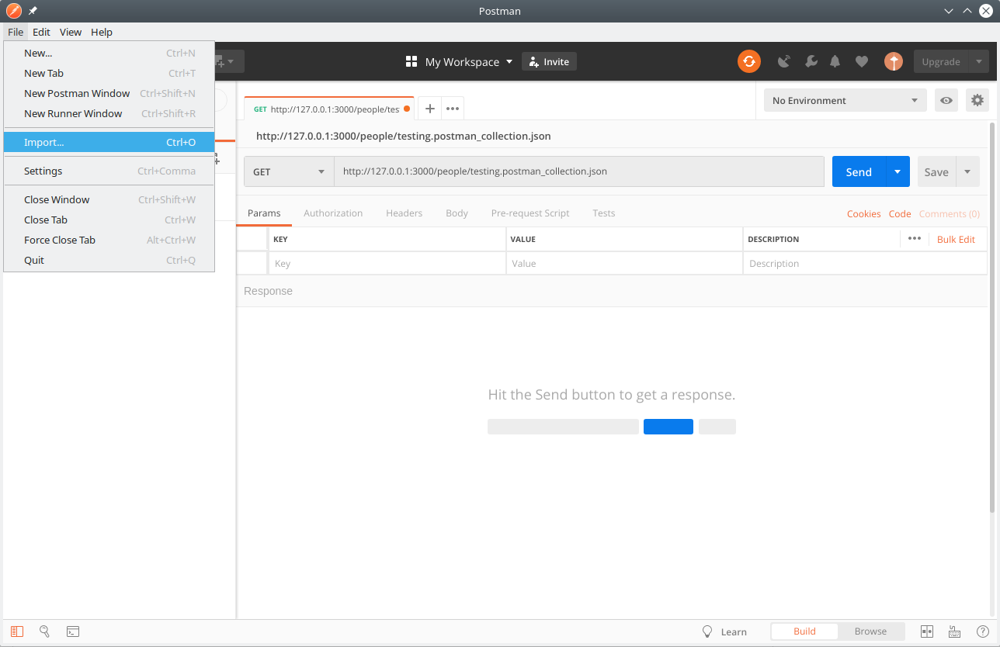
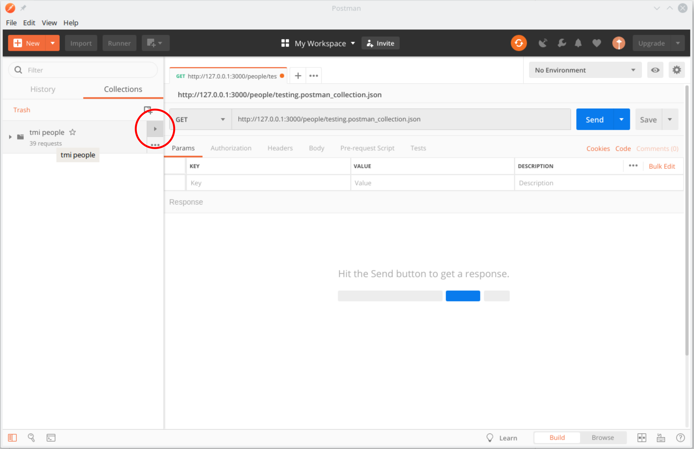
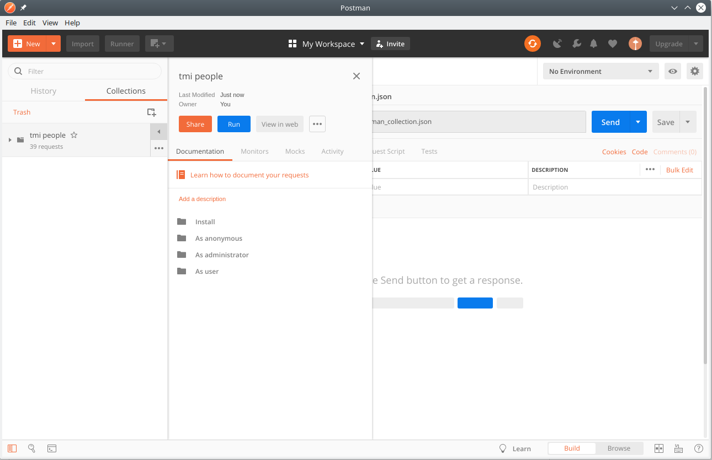
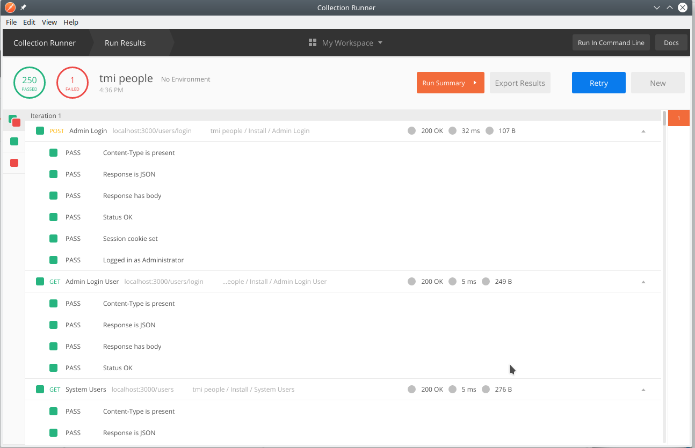

# TMI - Tribe Mobilisation Infrastructure
# Instaltion Guides


## Introduction

A set of tools to empower and mobilise communities to realise their own projects; A space to find and share resources without commercial agenda; A means to publish and share information without bias or manipulation; A facilitator of agreements; An ecosystem that nurtures, protects and promotes its participants.

* [Read more](./docs/Introduction.pdf)

## Development concept
TMI is built on a Micro Services Architecture. The default design is a centralised database manager utilising the TMI People subsystem. 

Each stand-alone front end system handles different needs of the community, connecting to the database through a standard [json:API](https://jsonapi.org/). The intention is that data should be easily accessible to anyone wanting to build there owe interface focused on their community needs or to utilise the parts of the system that are necessary for their current community needs. 

As many communities are already using tool for various aspects of their infrastructure, there is an API adaptor to allow the standard TMI API design to connect to your system. This can be with or without the use of the TMI People database manager. 

The system is also designed to use Single Sign-On such as OpenID to link accounts on various platforms and minimise the need to migrate users to utilise the various TMI Micro Services. 

## Getting TMI source

To check out the whole of TMI including its submodules:

```
git clone --recurse-submodules https://github.com/AfrikaBurn/TMI.git
```

Or alternatively, the various components may be checked out individually as per repository links in sections below:
* [People](#people)
* [Administration](#administration)
* [Tribe](#tribe)
* [Projects](#projects)
* [Events](#events)
* [Incidents](#incidents)
* [Ground Zero](#ground-zero)
* [Inventory](#inventory)
* [Web](#web)

## Development tools used
Our current in house development toolset is here as a suggestion to help get people on board and developing as quickly as possible. This does not imply we support or receive funding from any of these tools. If you more comfortable in other tools please feel free to use them.

All software used is free

### Development OS
Ubuntu or an Ubuntu flavour

Long term stable, 18.04 or higher

### Visual Studio
https://linuxize.com/post/how-to-install-visual-studio-code-on-ubuntu-18-04/

Version 1.31.1 or later

### Postman
https://www.getpostman.com

Once download you will need to register the software

Version 6.7.4 or later

### Nodejs
https://github.com/nodesource/distributions/blob/master/README.md

Version 11.10.1

<hr />

## Installation
Within a terminal, got to the people folder, then type:
```
npm install
```

## Running people

Within a terminal, one directory up from the downloaded TMI directory:
```
node People/
```

You should see startup output ending in:

```
Spinning up MINImal MIcroservices for TMI People

    WARNING: Memory stashes intended for testing only!
    They evaporate once the server stops!
    WARNING: Using memory based stash for session storage!
    It will fail with multiple connections!
    Use another stash for production.


Occupying http://127.0.0.1:3000

TMI People is ready.
```

This means the people services are running and awaiting requests.
Warnings will be present in the startup output until database integration has been completed.


**For now TMI People runs in memory alone.**

For more detailed output, run people with the verbose switch:

```
node People/ -v
```

## Test People

Fire up postman and on the "File" menu select "Import" and then import the [test collection](https://github.com/AfrikaBurn/tmi-people/blob/master/testing.postman_collection.json) at:
```
people/testing.postman_collection.json
```



Ensure you select collections on the left-hand side menu. 

Then click on the right arrow next to "tmi people".



From the popout menu select "run":



This will generate a list of all current system test and whether or not they passed or failed. 

You will be able to look at each call and see what was sent and the response from the server. 



You may start up the test runner in postman and execute the whole TMI collection, or fire them separately as examples of requests to direct at the people services. Note that the tests are not idempotent and some will fail on subsequent test runs.

It is best to restart people before running the whole suite again.

## Git Management

To pull the latest code on for TMI and all submodules:
git pull --recurse-submodules

##People

##Administration

##Tribe

##Projects

##Events

##Incidents

##Ground-zero

##Inventory

##Web
