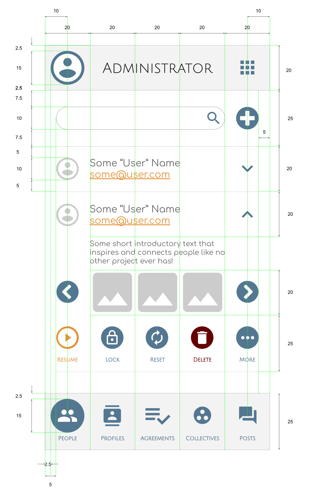

# App layout guide

To ensure a consistent experience Apps must conform to the following general
layout guide for the smallest supported resolution.

* Apps are devided into a header, content space and footer.
* Apps may utilise two icon sizes: small and large.
* Large icons are used within header and footer while small is used for content.
* The icons are from the Material Design set by google, with exceptions in
  special cases.
* Header and footer uses Julius Sans One font while content uses Comfortaa.
* Apps should use a columnar layout each column being assigned a width of 20
  units.
* Apps must adapt by increasing the number of colunms appropriate to the width,
  while maintaining a minimum of 5.

## Header

At the smallest supported resolution, the header:

* be the same height as the column width, at most.
* must use icons of 15x15 units, each centered within its cell.
* must have spacing of at least 2.5 units.
* must at least display the app title, centered on the center cell.
* must contain the current user avatar in the left most cell and link to their
  profile.
* Must contain the app selector menu in the rightmost cell.

## Footer

At the smallest supported resolution, the footer:

* be the 25 units in height, at most.
* must use icons of 15x15 units, each centered within its cell.
* must have spacing of at least 2.5 units.
* must contain the main navigation of the app.
* must contain icon labels.
* must indicate the active item by inverting the icon colour.

### Content

#### General

At the smallest supported resolution, content pages:

* must have a 5 unit left and right spacing.
* must have a 7.5 unit top and bottom spacing.
* must align with the global grid, apart from the 5 unit left and right content
  spacing.

#### Listings

Listing pages make up the bulk of apps and at the smallest supported resolution,
these pages:

* must start with a text filter box and, where applicable, a button to add an
  item. This must have a top and bottom spacing of 7.5 units and be followed by
  a devider.
* must seperate items with a devider.
* items must have an icon, image or summarising element in the leftmost column.
  Images and icons may not exceed 10x10 units and summarising elements may not
  bleed into the next column.
* collapsed items must be 20 units in height, including 5 units of top and
  bottom spacing.
* collapsed items must have a 10x10 unit icon containing a down pointing arrow
  in the right most column.
* items must have a label and may include an additional link, contained within
  the remaining columnms.
* when expanding item headers must remain constant, apart from arrow
  orientation.
* expanded items may include a summary text contained within the remaining
  columns.
* expanded items may include an image slider with left and right arrows in the
  first and last column, respectively.
* expanded items may include a maximum of 5 action icons not exceeding 10x10
  units and an action label. Any additional actions must be on the item page
  view.
* expanded tems must have a "More" action that leads to a full page item view.
