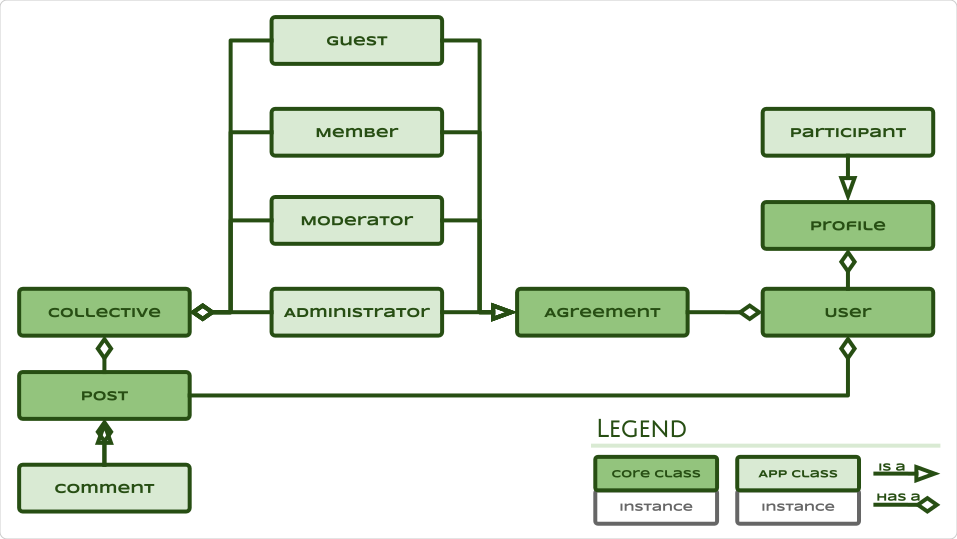
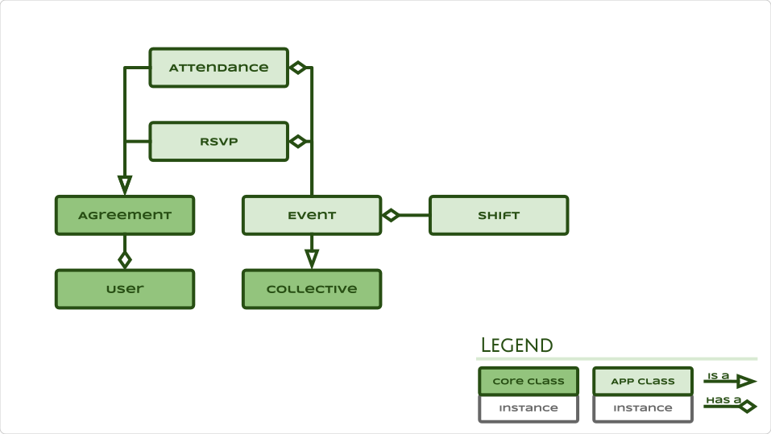
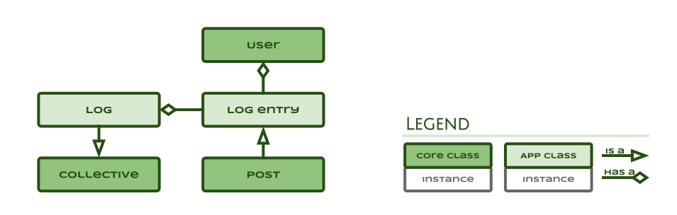
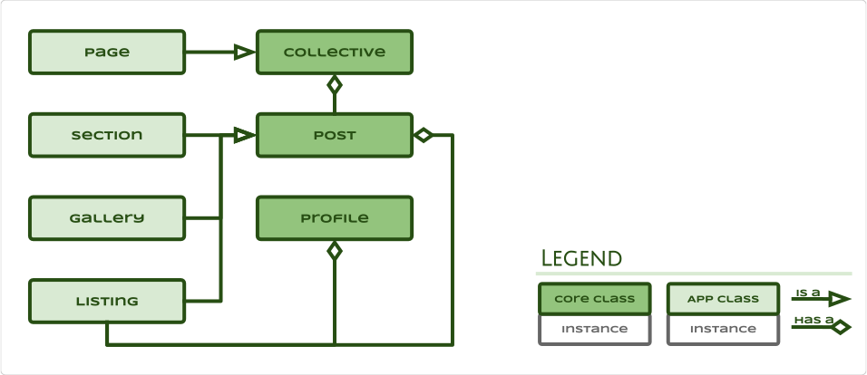

# TMI Architecture

> Social networking tools to empower and mobilise communities
so that they may realise their own ideas.

## People

> Store and protect community data.

The people subsystem is intended to store participant's user login, profile,
agreement, collective and post data in a secure manner that protects and
enforces access and privacy so that other subsystems may access data in a
simple unified and permissable manner.

### Entity Relationships

### Entity Classes

### Access control and privacy protection

## Tribe

> Represent, connect and collect participants.

The tribe subsystem is intended to be the social networking interface between
participants that they may find and connect with other participants and share
resources.

### Entity Classes

#### Flag uses

* **Adult** - Content inappropriate for minors.
  (Sexual in nature, etc.)
  Automatically hidden from minors and blurred to certain participants until reviewed.
* **Abusive** - Content that is abusive to another participant or group.
  (Racist, Hate speech, etc.)
  Automatically hidden from minors and blurred to certain participants until reviewed.
* **Explicit** - Content triggering in nature.
  (Broken bones, medical operations, etc.)
  Automatically hidden from minors and blurred to certain participants until reviewed.
* **False** - Content that is false.
  (False claims by participants, etc.)
  Automatically hidden from minors and flag displayed to participants until reviewed.
* **Dangerous** - Content that is unsafe.
  (Don't try this at home)
  Automatically hidden from minors and flag displayed to participants until reviewed.
* **Inaccurate** - Information that is unintentionally incorrect.
  (Shared fake news, etc.)
  Automatically hidden from minors and flag displayed to participants until reviewed.
* **Misleading** Content that is meant to mislead participants.
  (Fake news, etc.)
  Automatically hidden from minors and flag displayed to participants until reviewed.
* **Violent** - any content that is violent or promotes violence.
  Automatically hidden from minors and blurred to certain participants until reviewed.
* **Infringement** - any content that infringes on the rights of participants.
  (Non-consentual photographs, copyright, etc.)
  Automatically hidden from minors and participants until reviewed.

## Projects

> Create and collaborate.

The projects subsystem is intended to facilitate project publishing so that
participants may inform communities to enable collaboration.

## Events

> Schedule, coordinate, volunteer and participate.

The projects subsystem is intended to facilitate event publishing so that
participants may rally communities to plan and participate.

## Incidents

> Incident logging, dissemination and escalation.

The incident subsystem is intended to manage incidents so that collectives may
be informed and responsive to incidents as they occur.

## Inventory

> Manage, track and trace assets and inventory.

The inventory subsystem is intended to keep track of collective resources so
that they may be effectively shared and maintained.

## Web

> Educate, inform and promote.

The website subsystem is intended to allow participants to educate, inform and
promote projects, collectives, initiatives and events to the outside world so
that they may grow their community.

