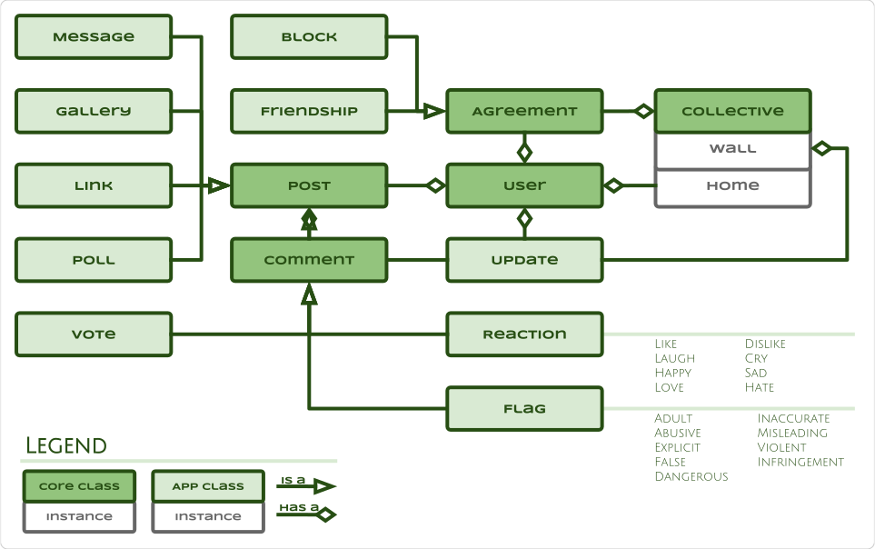

# TMI Architecture

## People

Store and protect community data.

### Entity Relationships

### Entity Classes

## Tribe

Represent, connect and collect participants.

### Entity Classes

## Projects

Create and collaborate.

## Events

Schedule, coordinate, volunteer and participate.

## Incidents

Incident logging, dissemination and escalation.

## Inventory

Manage, track and trace assets and inventory.

## Web

Website that educates, informs and promotes projects, collectives, initiatives
and events.

