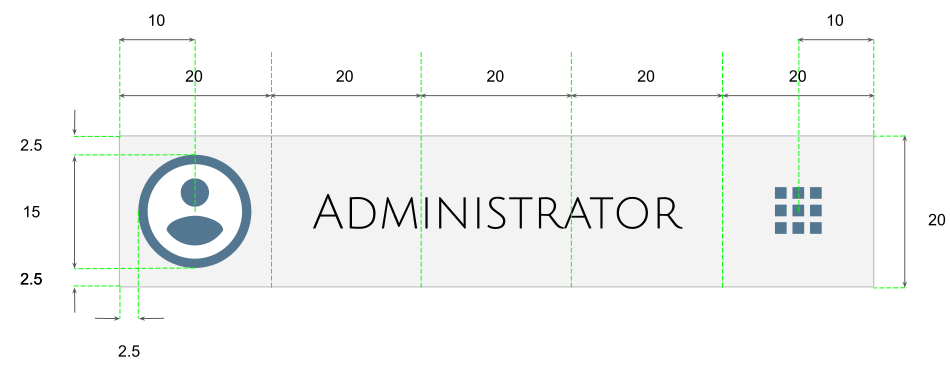
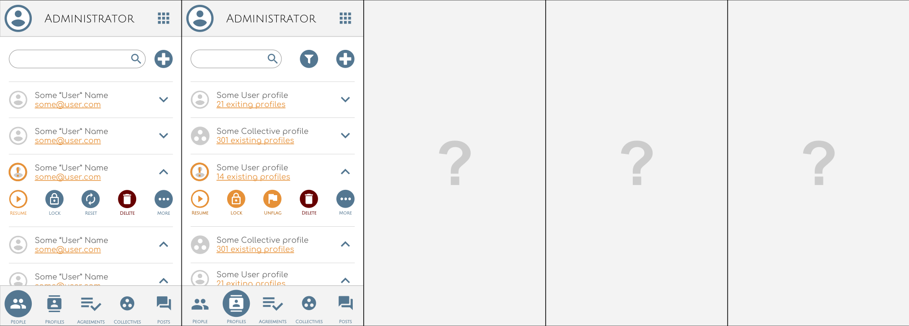
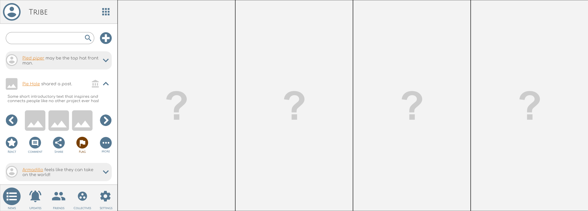
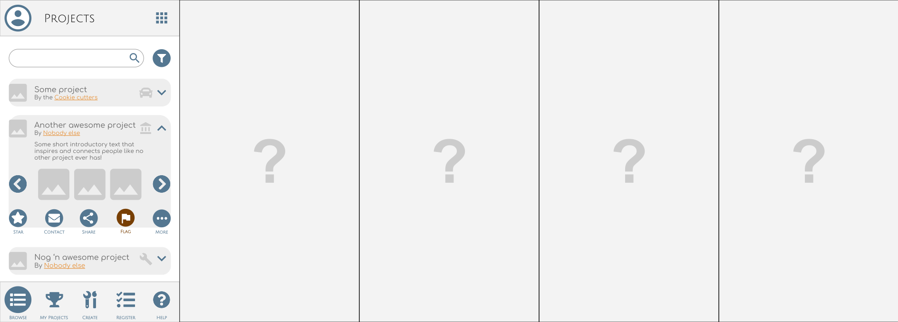
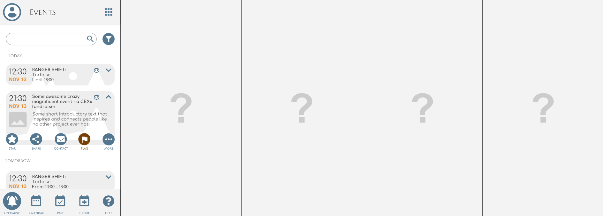
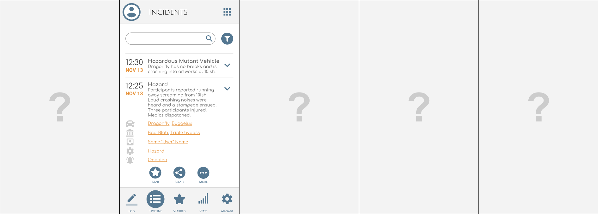
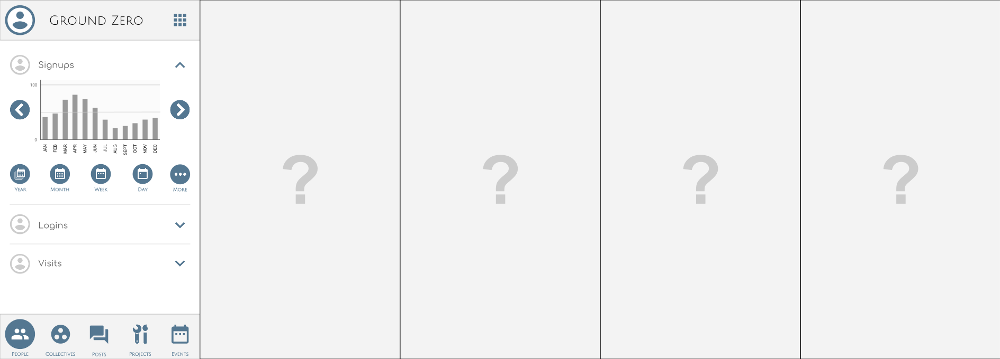
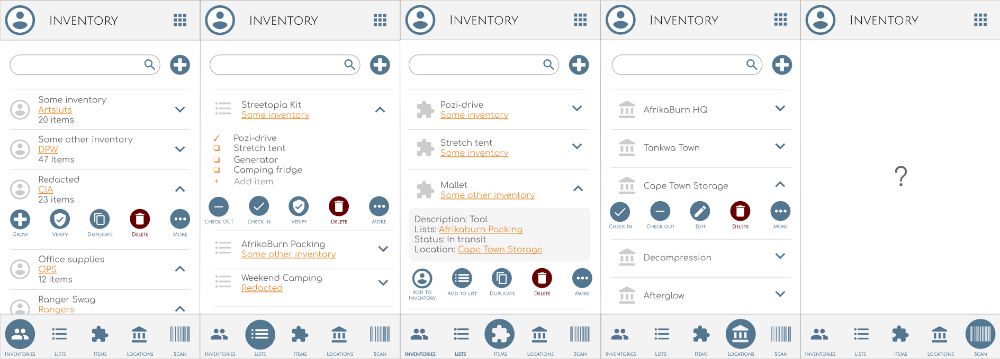

# TMI Design

## Application Layout

To ensure a consistent experience Apps must conform to the following general
layout guide for the smallest supported resolution.

* Apps are devided into a header, content space and footer.
* Apps may utilise two icon sizes: small and large.
* Large icons are used within header and footer while small is used for content.
* The icons are from the Material Design set by google, with exceptions in
  special cases.
* Header and footer uses Julius Sans One font while content uses Comfortaa.

### Header

At the smallest supported resolution, the app:

* must have 5 columns of equal width.
* header must at most be the same height as the column width.
* header must use icons of 15x15 units and centered within its cell.
*

## Administration

Administer TMI community data.

## Tribe

Represent, connect and collect participants.

## Projects

Create and collaborate.

## Events

Schedule, coordinate, volunteer and participate.

## Incidents

Incident logging, dissemination and escalation.

## Monitor

Realtime monitoring of anonymised interactions and trends.

## Inventory

Manage, track and trace assets and inventory.

## Web

Website that educates, informs and promotes projects, collectives, initiatives
and events.

