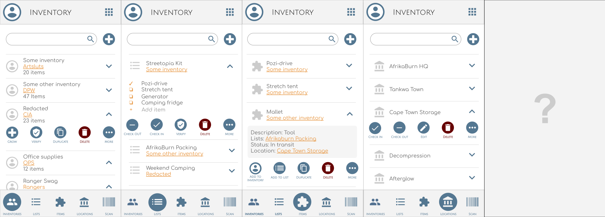

# TMI Design

To ensure a consistent experience apps follow the same layout of
functionality. Check out the [Layout Guide](./layout-guide.md) if you're
skinning an app or want to build your own.

## Administration

Administer TMI community data.

## Tribe

Represent, connect and collect participants.

## Projects

Create and collaborate.

# App layout guide

## Events

Schedule, coordinate, volunteer and participate.

## Incidents

Incident logging, dissemination and escalation.

## Monitor

Realtime monitoring of anonymised interactions and trends.

## Inventory

Manage, track and trace assets and inventory.

