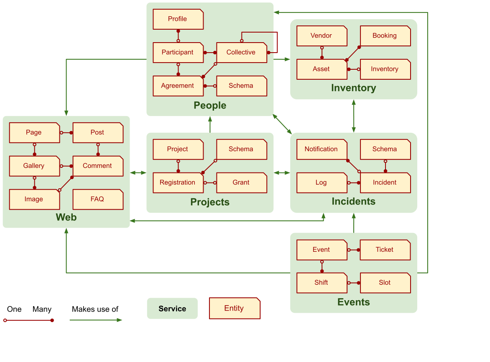
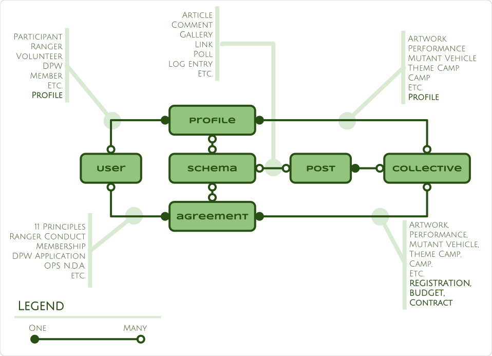
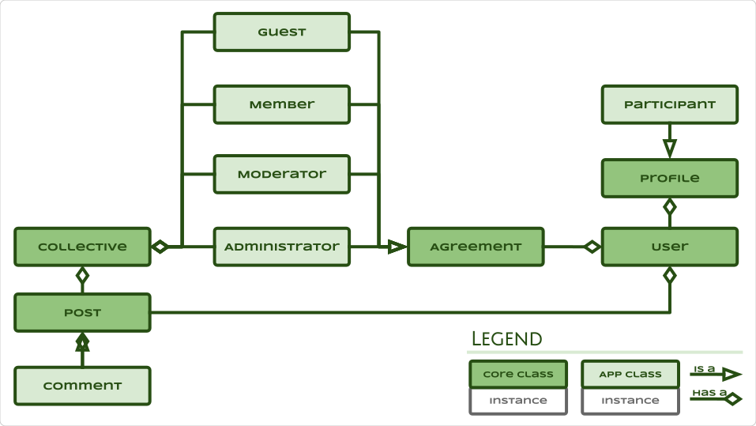
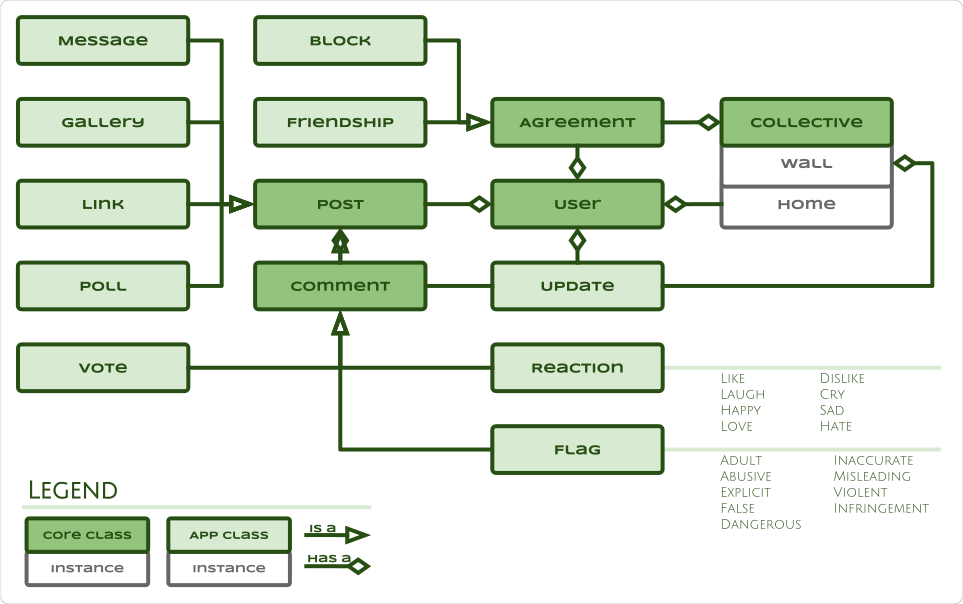
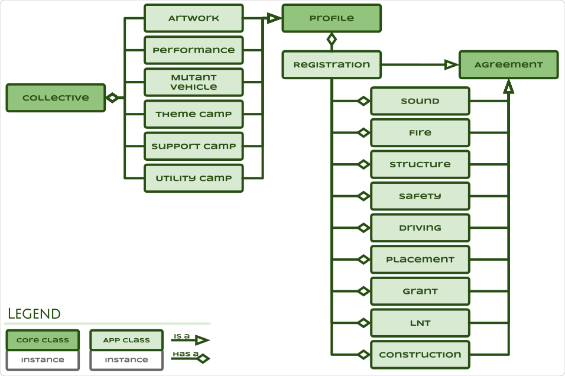
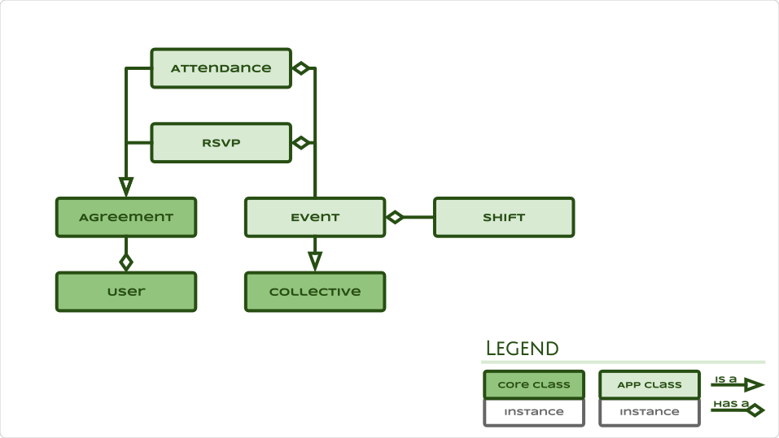
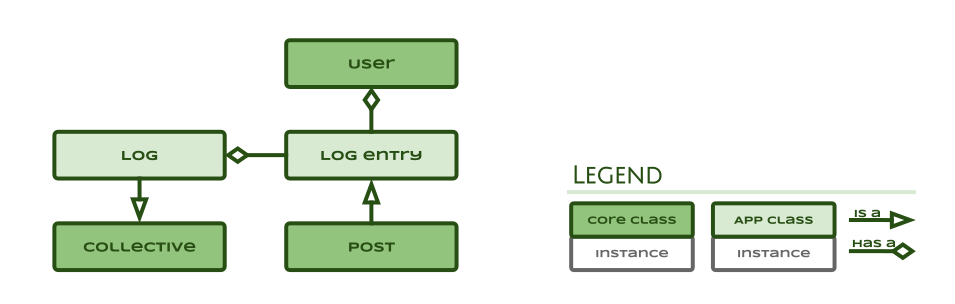
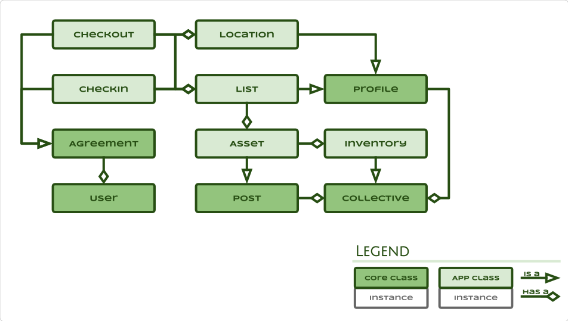
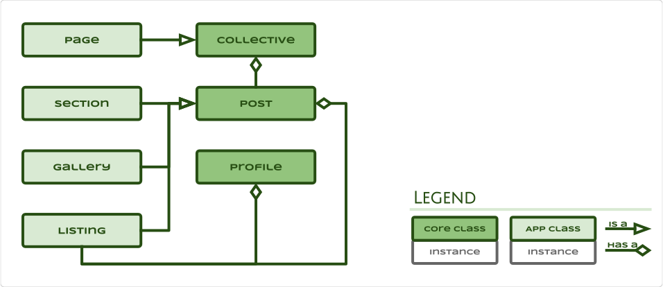

# TMI Engineering

## Data storage

### Identified entities

During analysis the following 24 entities were identified loosely grouped in 6
services:

### Normalised entities

These 24 entities may be normalised down to 5 entities and a taxonomy of
Profile, Post and Agreement schemas:

## People

Store and protect people, their associations and information sharing.

### Entity Classes

## Tribe

Represent, connect and collect participants.

### Entity Classes

## Projects

Create and collaborate.

## Events

Schedule, coordinate, volunteer and participate.

## Incidents

Incident logging, dissemination and escalation.

## Inventory

Manage, track and trace assets and inventory.

## Web

Website that educates, informs and promotes projects, collectives, initiatives
and events.

