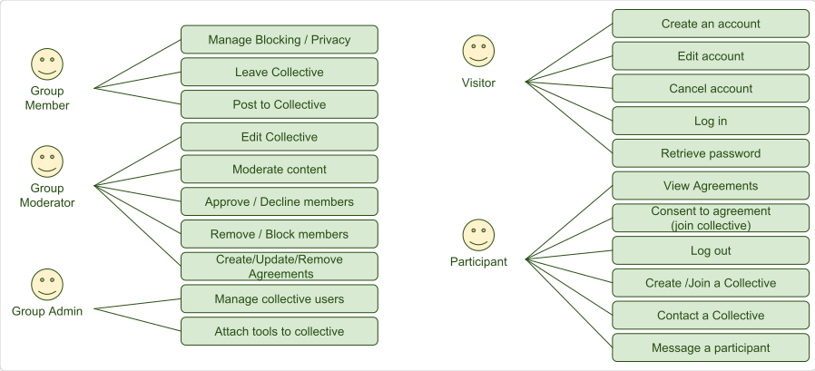
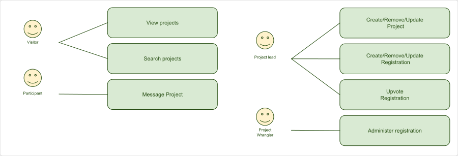
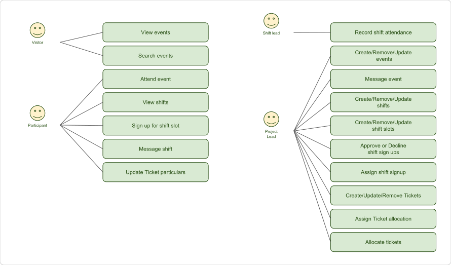
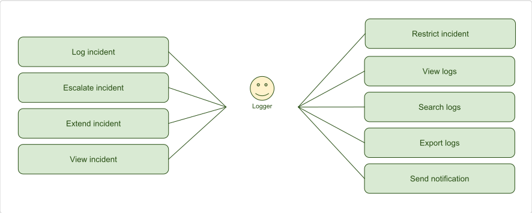
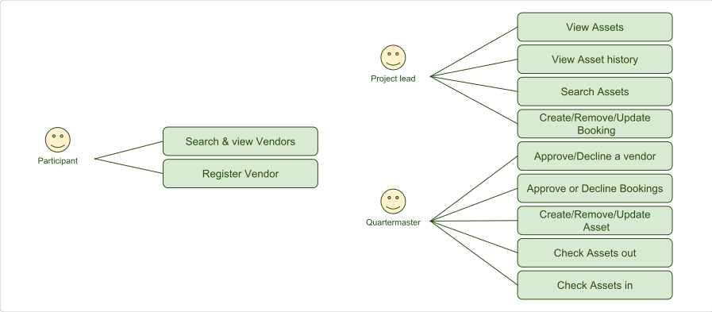
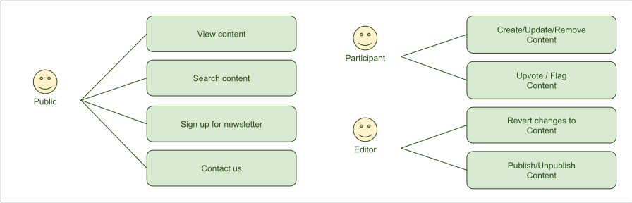

# TMI requirements

## Tribe

Represent, connect and collect participants.

### Visitor

* As a visitor, I would like to create an account so I may interact with participants and collectives, create and register projects, and gain access to tickets.
Ideally I should be added to a default AfrikaBurn collective on registration.
* As a visitor, I would like to update my account so that my details are up to date. Ideally the system should remind me before a ticket sale.
* As a visitor, I would like to be able to cancel my account so that I may no longer be part of the tribe or receive updates. Ideally the system should remove any personal detail permanently.
* As a visitor, I would like to be able to log in so that I may use the toolset. Ideally the system should be able to remember me and log me in automatically.
* As a visitor I would like to be able to retrieve my password so that I may access the toolset even when I have forgotten my details. Ideally the system should ask security questions or details to verify me.

### Participant

* As a participant I would like to be able to view my agreements, so that I may be able to see which collectives I belong to, which projects I have created and registered, and whatever other agreements like codes of conduct I have agreed to. Ideally the system should make it easy for me to view these based on projects, collectives and individuals.
* as a participant I would like to be able to consent to agreements so that I may join collectives, become an administrator of collectives, manage my privacy, become a ranger, DPW member etc. Ideally the system should prepopulate these from existing information from my profiles.
* As a participant I would like to be able to log out so that I may use the system on public computers in a secure manner. Ideally the system should ask whether I am using a public, computer and log me out automatically on those.
* As a participant I would like to create collectives so that I may effectively group my communication with other participants, create and register projects, have discussions and plan and collaborate effectively.
* As a participant I would like to be able to contact a collective so that I may gather information that will help me decide whether I would like to join the collective. Ideally the system would forward such communication to all admins.
* As a participant I would like to be able to message another participant so that we may exchance information in a private forum. Ideally the system would alert the recipient.

### Group member

* As a member I would like to manage my privacy so that I may control what information I share with other members and the admins of a collective. Ideally the system should make it easy for me to get an overview of what information I share site wide.
* As a member I would like to leave a collective so that I am no longer a member, no longer receive notifications and stop collaborating with the other members. Ideally my details shared with the collective should be unshared when I leave.
* As a member I would like to be able to post to a collective so that I may share information with the collective members. Ideally the system should allow for the collective to control who may post in a collective.

### Group moderator

* As a moderator I would like to be able to edit a collective so that the collective information, privacy and project capabilities may change. Ideally the members would be alerted to such changes.
* As a moderator I would like to be able to moderate content so that the group content may remain respectful and relevant. Ideally members should be able to alert moderators of questionable content.
* As a moderator I would like to be able to approve or decline membership so that the membership may be curated. Ideally the system should alert all moderators on membership requests.
* As a moderator I would like to be able to remove and block members so that the integrity of the group may be maintained. Ideally all the moderators should be alerted to such action.
* As a moderator I would like to be able to create or update agreements types so that the I may customise the requirements and roles of group members. Ideally the system would have default agreements for membership, moderatorship, administratorship, project registration, crew application and registration as well as NDAs and codes of conduct. 

### Group administrator

* As a group administrator I would like to manage group members so that I may curate membership, moderatorship and administratorship. Ideally the system would inform other administrators to these changes.
* As a group administrator I would like to attach toools like project creation, registration, specification and planning to a collective. Ideally some tools will be attached by default.

## Projects

Create and collaborate.

### Visitor

* As a visitor I would like to be able to view projects so that I may get an idea of the types of projects that is being realised within the system. Ideally the system should show past, present and planned projects that are set to be publically visible.
* As a visitor I would like to be able to search projects so that I may be able to see the kind of projects I may be interested in.
* As a participant I would like to be able to message a project so that I may gather additional information or contribute to the project. Ideally the system would alert moderators of the project.

### Project lead

* As a project lead I would like to be able to create/update projects so that I may be able to engage with other participants to collaborate and share workload in realising a project. Ideally the system would provide tools to allow better collaboration.
* As a project lead I would like to register projects so that I may publicise my intent to bring a project to an event, gain access to funding, collaboration and mentoring from an event organiser. Ideally the system would prepopulate as much information as possible from the project into the registration.
* As a project lead I would like to be able to upvote project registrations as part of the grant process so that I may show support for the funding efforts of projects. Ideally the system would allow all participating projects to vote.

### Project Wrangler

> A project wrangler is an Event organiser or their delegate: An administrator or moderator, respectively of an event group.

* As a wrangler I would like to be able to administer projects so that I may be able to curate and publicise which projects are attending the event as well as assign grant allocations. Ideally the system would facilitate creating reports.

## Events

Schedule, coordinate, volunteer and participate.

### Visitor

* As a visitor I would like to be able to view events so that I may attend or find out additional information about them. Ideally I should be shown events that are nearby or aligns with my interest.
* As a visitor I would like to be able to search events so that I may be able to find specific events. Ideally the system should allow me to search by location, name, date and classification.
* As a participant I would like to indicate my event attendance so that I may be alerted to changes, reminded closer to the date of the event and my friends may see what events I am interested in attending. Ideally the system would allow me to invite my friends.
* As a participant I would like to see what shifts are avaialble so that I may sign up and contribute to events and projects at the event. Ideally the system would align these with my skills and preferences.
* As a participant I would like to be able to sign up for a shift so I may contribute and receive reminders of my upcoming shifts. Ideally the system should also warn me if I attempt to sign up for conflicting shifts.
* As a participant I would like to be able to message the participants my shift to be able to effectively collaborate and coordinate our shift. Ideally the system would allow for bulk and individual messaging from both participants, shift lead and organiser.
* As a participant I would like to be able to update my ticketing information so that I may gain entrance to the event or transfer my ticket. Ideally the system would take into account limitations placed on the ticketing by the event organisers.

### Shift lead

* As a shift lead I would like to record shift attendance so that the reputations of participants may be maintained. Ideally the system would make this information available to organiserss at the participants discression for exclusive shifts.

### Project lead

> Examples of project leads may be Artists, Ranger council, Volunteers portfolio or event organisers.

* As a project lead I want to be able to create events so that I may effectively coordinate and execute commu8nal efforts. Ideally the system would publicise and promote events at the leads discression. 
* As a project lead I would like to message the event attendees so that I may disseminate up to date information. Ideally the system would make this information available to all participants who indicated that they will be attending.
* As a project lead I would like to create/update shifts so that participants may sign up for shifts. Ideally the system would display and enforce the capacity vs. signups.
* As a project lead I would like to be able to add/update/delete shift slots so that I may specify numbers and roles of needed participants. Ideally the system would allow for minimum, specific or an unlimited number of sign ups per role per shift.
* As a project lead I would like to optionally approve or decline shif signups so that I may curate the participants and their commitments on a shift. Ideally the system will notify the project lead of signups and reminders to moderate.
* As a project lead I may want to be able to assign shift slots to participants so that I may plan shift population according to my own requirements. Ideally the system would allow participants to indicate a willingness to do shifts and add them to a pool of assignables to a shift.
* As a project lead I want to be able to create tickets so that I may curate both the number and role of participants. Ideally the system would communicate with an external ticket vendor to outsource transactions and fees.
* As a project lead I would like to be able to allocate tickets so that I may promote particular roles. Ideally the system would keep track of, produce reports on these assignments and notify participants of assignments.
* As a project lead I would like to be able to assign ticket allocation so that I may outsource ticket allocations to moderators or collaborators.

## Incidents

Incident logging, dissemination and escalation.

## Inventory

Manage, track and trace assets and inventory.

## Web

Website that educates, informs and promotes projects, collectives, initiatives
and events.

