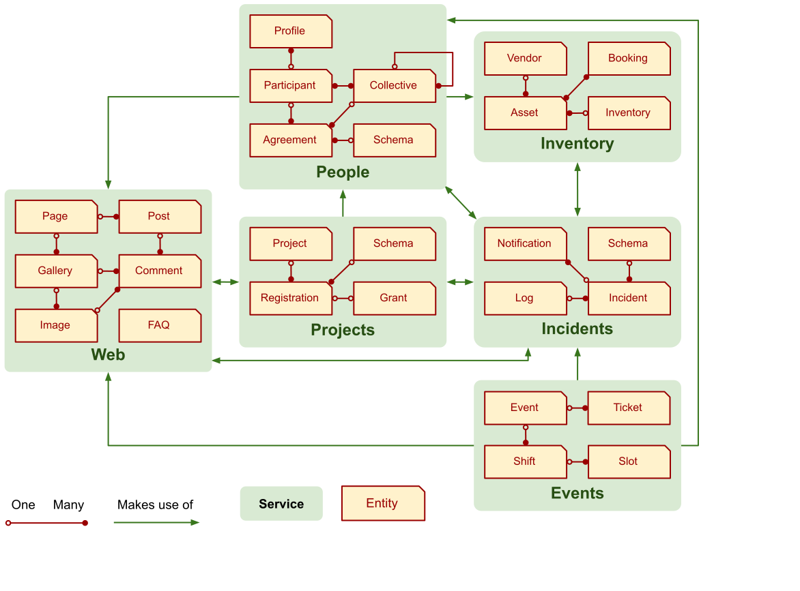
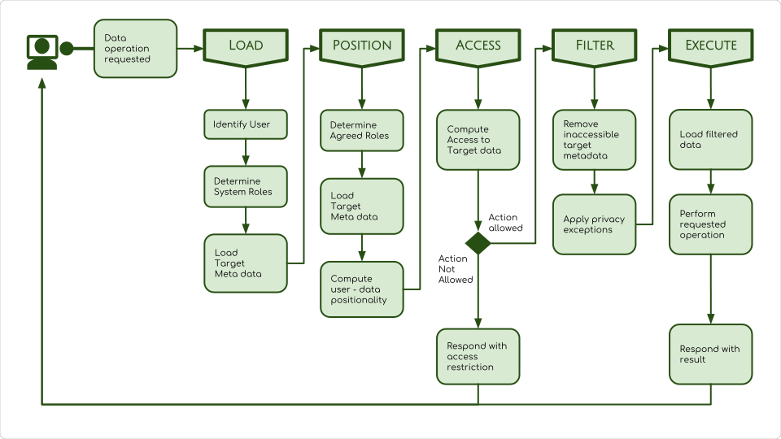

# TMI requirements

## Services

## Privacy

To ensure privacy, requests to the people service are processed in the following
manner:

## Tribe

Represent, connect and collect participants.

## Projects

Create and collaborate.

## Events

Schedule, coordinate, volunteer and participate.

## Incidents

Incident logging, dissemination and escalation.

## Inventory

Manage, track and trace assets and inventory.

## Web

Website that educates, informs and promotes projects, collectives, initiatives
and events.

